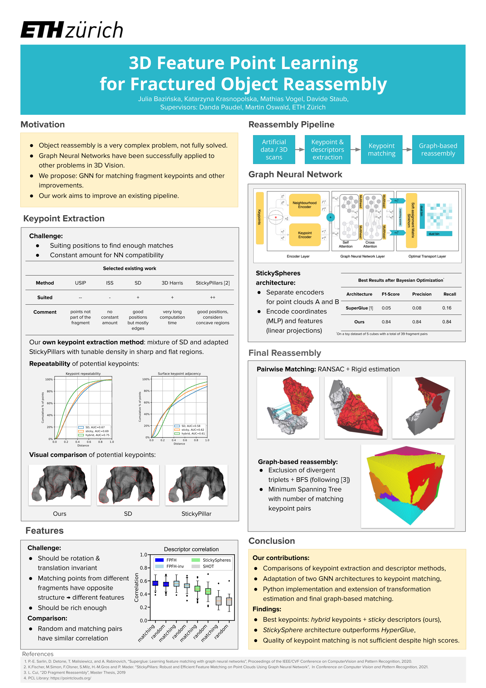

# 3D Object Reassembly
Group 19: Mathias Vogel, Julia Bazińska, Katarzyna Krasnopolska, Davide Staub
Project as a part of 3D Vision course.


## Quickstart
Tested on Ubuntu 18.06 with Python 3.7.5.

```
pip install -r requirements.txt
cd full_pipeline
python3 reassemble_object.py --object_dir ./example_data/cube_10_seed_0
```

You should see first a visualization of a scrambled cube and then another one reassembled using ground truth data. In order to use the network predictions for keypoint matching, use the following command: 
```
python3 reassemble_object.py --object_dir ./example_data/cube_10_seed_0 --use_predictions
```

## Project structure
- evaluation – contains the scripts for evaluating keypoints and plotting the results. 
- full_pipeline – reassemble an object from its shards, including all necessary intermediate steps.
- keypoints_and_descriptors – calculations of keypoints and descriptors.
- neural_network – build and train a neural network and use it for predictions.
- object_fracturing – fracture objects with blender and preprocess the objects for the neural network.
- object_reassembly – load preprocessed object fragments and reassemble either using ground truth matches or predictions from 
the network.

# Troubleshooting
In case you encounter an error `TypeError: 'exclusive' is an unknown keyword argument`, then execute this with the appropriate path:

```
sed -i 's/QtWidgets.QActionGroup(self.window, exclusive=True)/QtWidgets.QActionGroup(self.window)/' $PATH_TO_YOUR_VIRTUAL_ENV/lib/python3.7/site-packages/compas_view2/app/app.py
```
